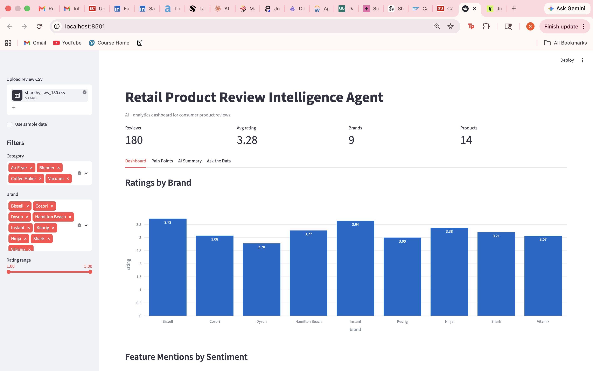
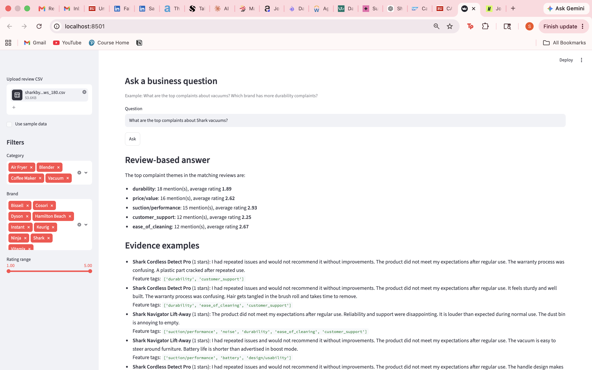
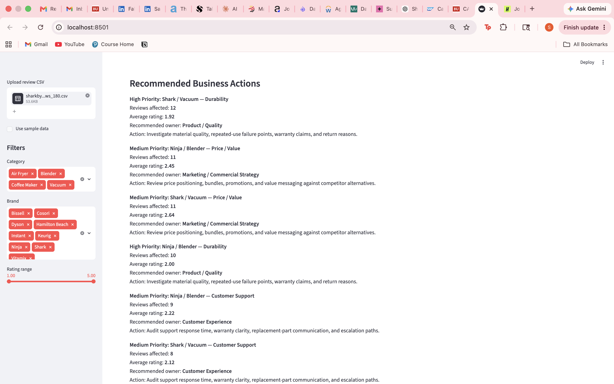
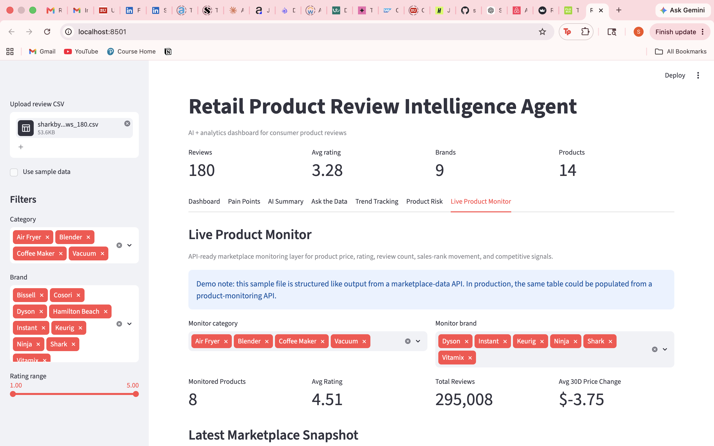
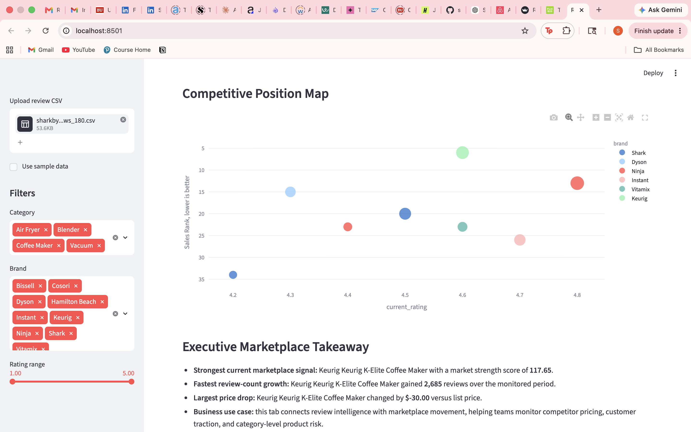

# Retail Product Review Intelligence & Marketplace Monitor

An AI-assisted analytics dashboard for understanding consumer product reviews, product risk signals, and marketplace movement.

## Project Overview

Consumer product teams receive large volumes of customer reviews, but it can be difficult to quickly identify the recurring issues that affect ratings, satisfaction, returns, and brand perception.

This project analyzes product review data across consumer product categories, classifies reviews into feature-level complaint themes, summarizes top pain points, and recommends business actions for Product, Quality, Marketing, and Customer Experience teams.

The project also includes a marketplace-monitoring layer designed to track product price, rating, review count, sales rank, and competitive movement using API-ready data structures.

## Screenshots

### Review Intelligence Dashboard



### Ask the Data



### Business Action Recommendations



### Marketplace Monitor Overview



### Competitive Position Map



## Key Features

* Ingests product review CSV data and standardizes it for analysis
* Classifies reviews into feature-level complaint themes such as durability, price/value, suction/performance, battery, noise, customer support, and ease of cleaning
* Uses an LLM-powered review Q&A layer with retrieved review evidence
* Supports OpenAI and Anthropic API configuration through environment variables
* Falls back to local TF-IDF retrieval when no LLM API key is configured
* Scores product risk using review volume, average rating, and negative/mixed review share
* Tracks review volume, rating movement, and complaint themes over time
* Maps recurring issues to business actions for Product, Quality, Marketing, and Customer Experience teams
* Includes an API-ready marketplace monitor for product price, rating, review count, sales rank, and competitive movement

## Example Business Questions

* What are the top complaints about vacuums?
* What are the top complaints about Shark vacuums?
* Which products have durability issues?
* Which brands have price/value problems?
* Which products show the highest product risk?
* Which competitors are gaining review traction?
* What actions should Product or Quality teams prioritize?

## Tech Stack

* Python
* Streamlit
* pandas
* NumPy
* Plotly
* scikit-learn
* OpenAI / Anthropic API support
* TF-IDF retrieval
* Rule-based feature tagging
* CSV-based data ingestion

## Data Note

The review analytics workflow supports uploaded product review datasets as well as local sample data for demonstration. The sample review data is structured to simulate realistic consumer-product feedback across categories such as vacuums, air fryers, blenders, and coffee makers.

The marketplace monitor uses an API-ready sample dataset designed to represent fields that could be populated from marketplace product-data APIs, including ASIN, price, rating, review count, sales rank, and recent movement metrics.

No private company data is used.

## How to Run Locally

```bash
python -m venv .venv
source .venv/bin/activate
pip install -r requirements.txt
python -m streamlit run app.py
```

## Optional LLM Setup

Create a local `.env` file and add either an OpenAI or Anthropic API key.

OpenAI example:

```bash
LLM_PROVIDER=openai
OPENAI_API_KEY=your_key_here
OPENAI_MODEL=gpt-4.1-mini
```

Anthropic example:

```bash
LLM_PROVIDER=anthropic
ANTHROPIC_API_KEY=your_key_here
ANTHROPIC_MODEL=claude-3-5-sonnet-latest
```

When no API key is configured, the app uses local retrieval fallback so the dashboard remains usable.

## Business Impact

This project demonstrates how AI-assisted analytics can help consumer product teams monitor customer feedback, detect recurring product issues, compare marketplace movement, and translate review signals into actionable recommendations.
